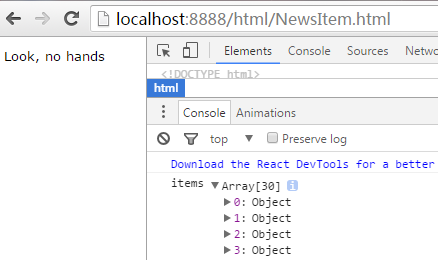
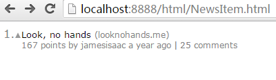

React HN
===
This is a visual React tutorial. This tutorial should give you a feel for "growing" a React UI from small, modular parts. By the end of this tutorial, you will have built the [HN front page in React](https://mking.github.io/react-hn).

> Note: This tutorial covers React, Browserify, and CSS. It does not cover event handling (not needed for the HN front page), state (not needed for the HN front page), or Flux.

This tutorial has five parts:

 1. [Setup](#setup)

 1. [NewsItem component](#newsitem)

 1. [NewsHeader component](#newsheader)

 1. [NewsList component](#newslist)

 1. [Display live data from the Hacker News API](#hacker-news-api)

---

Setup
---
 1. Create the project directory structure.
    ```bash
    mkdir -p hn/{build/js,css,html,img,js,json}
    cd hn
    ```

    > Note: We will be building the project from scratch. The solution in this repo is meant primarily to be a reference.

 1. [Download the sample data](https://raw.githubusercontent.com/mking/react-hn/master/json/items.json) into /json.

 1. Create /package.json.
    ```json
    {
      "name": "hn",
      "version": "0.1.0",
      "private": true,
      "browserify": {
        "transform": [
          ["reactify"]
        ]
      }
    }
    ```

 1. Install Browserify, React, and tools.
    ```bash
    # These dependencies are required for running the app.
    npm install --save react jquery lodash moment

    # These dependencies are required for building the app.
    npm install --save-dev browserify watchify reactify

    # These dependencies are globally installed command line tools.
    npm install -g browserify watchify http-server
    ```

[Next](#newsitem)

---

NewsItem
---
 1. [Display the title.](#newsitem-title)

 1. [Add the domain.](#newsitem-domain)

 1. [Add the subtext.](#newsitem-subtext)

 1. [Add the rank and vote.](#newsitem-rank-and-vote)

[Previous](#setup) &middot; [Next](#newsitem-title)

---

NewsItem Title
---
 1. Create a new JS file: /js/NewsItem.js.
    ```javascript
    var $ = require('jquery');
    var React = require('react');

    var NewsItem = React.createClass({
      render: function () {
        return (
          <div className="newsItem">
            <a className="newsItem-titleLink" href={this.props.item.url}>{this.props.item.title}</a>
          </div>
        );
      }
    });

    module.exports = NewsItem;
    ```

    > Note: You should be able to paste this code directly into your JS file.

 1. Create a new JS file: /js/NewsItemTest.js.
    ```javascript
    var $ = require('jquery');
    var NewsItem = require('./NewsItem');
    var React = require('react');

    $.ajax({
      url: '/json/items.json'
    }).then(function (items) {
      // Log the data so we can inspect it in the developer console.
      console.log('items', items);
      // Use a fake rank for now.
      React.render(<NewsItem item={items[0]} rank={1}/>, $('#content')[0]);
    });
    ```

    > Note: This lets us develop the NewsItem component in isolation, rather than requiring it to be hooked into the full app.

 1. Create a new CSS file: /css/NewsItem.css. We are following [Jacob Thornton's CSS style guide](https://medium.com/@fat/mediums-css-is-actually-pretty-fucking-good-b8e2a6c78b06).
    ```css
    .newsItem {
      color: #828282;
      margin-top: 5px;
    }

    .newsItem-titleLink {
      color: black;
      font-size: 10pt;
      text-decoration: none;
    }
    ```

 1. Create a new CSS file: /css/app.css.
    ```css
    body {
      font-family: Verdana, sans-serif;
    }
    ```

 1. Create a new HTML file: /html/NewsItem.html.
    ```html
    <!DOCTYPE html>
    <html>
      <head>
        <meta charset="utf-8">
        <title>NewsItem</title>
        <link href="../css/NewsItem.css" rel="stylesheet">
        <link href="../css/app.css" rel="stylesheet">
      </head>
      <body>
        <div id="content"></div>
        <script src="../build/js/NewsItemTest.js"></script>
      </body>
    </html>
    ```

 1. Start Watchify. This compiles your React (JSX) components into ordinary JavaScript.
    ```bash
    watchify -v -o build/js/NewsItemTest.js js/NewsItemTest.js
    ```

 1. Start the HTTP server.
    ```bash
    http-server -p 8888
    ```

 1. Visit [http://localhost:8888/html/NewsItem.html](http://localhost:8888/html/NewsItem.html). You should see the following.

    

    

[Previous](#newsitem) &middot; [Next](#newsitem-domain)

NewsItem Domain
---
 1. Update the JS.
    ```javascript
    // ...
    var url = require('url');

    var NewsItem = React.createClass({
      // ...

      getDomain: function () {
        return url.parse(this.props.item.url).hostname;
      },

      render: function () {
        return (
          <div className="newsItem">
            ...
            <span className="newsItem-domain">
              ({this.getDomain()})
            </span>
          </div>
        );
      }
    ```

    > Note: This code should be added onto the existing code in /js/NewsItem.js.

 1. Update the CSS.
    ```css
    .newsItem-domain {
      font-size: 8pt;
      margin-left: 5px;
    }
    ```

    > Note: This code should be added onto the existing code in /css/NewsItem.css.

 1. Refresh the browser. You should see the following.

    

[Previous](#newsitem-title) &middot; [Next](#newsitem-subtext)

---

NewsItem Subtext
---
 1. Update the JS. Note: We are factoring out the title part into its own method.
    ```javascript
    // ...
    var moment = require('moment');

    var NewsItem = React.createClass({
      // ...

      getCommentLink: function () {
        var commentText = 'discuss';
        if (this.props.item.kids && this.props.item.kids.length) {
          // This only counts top-level comments.
          // To get the full count, recursively get item details for this news item.
          commentText = this.props.item.kids.length + ' comments';
        }

        return (
          <a href={'https://news.ycombinator.com/item?id=' + this.props.item.id}>{commentText}</a>
        );
      },

      getSubtext: function () {
        return (
          <div className="newsItem-subtext">
            {this.props.item.score} points by <a href={'https://news.ycombinator.com/user?id=' + this.props.item.by}>{this.props.item.by}</a> {moment.utc(this.props.item.time * 1000).fromNow()} | {this.getCommentLink()}
          </div>
        );
      },

      getTitle: function () {
        return (
          <div className="newsItem-title">
            ...
          </div>
        );
      },

      render: function () {
        return (
          <div className="newsItem">
            {this.getTitle()}
            {this.getSubtext()}
          </div>
        );
      }
    ```

 1. Update the CSS.
    ```css
    .newsItem-subtext {
      font-size: 7pt;
    }

    .newsItem-subtext > a {
      color: #828282;
      text-decoration: none;
    }

    .newsItem-subtext > a:hover {
      text-decoration: underline;
    }
    ```

 1. Refresh the browser. You should see the following.

    

[Previous](#newsitem-domain) &middot; [Next](#newsitem-rank-and-vote)

---

NewsItem Rank and Vote
---
 1. Update the JS.
     ```javascript
    var NewsItem = React.createClass({
      // ...

      getRank: function () {
        return (
          <div className="newsItem-rank">
            {this.props.rank}.
          </div>
        );
      },

      getVote: function () {
        return (
          <div className="newsItem-vote">
            <a href={'https://news.ycombinator.com/vote?for=' + this.props.item.id + '&dir=up&whence=news'}>
              
            </a>
          </div>
        );
      },

      render: function () {
        return (
          <div className="newsItem">
            {this.getRank()}
            {this.getVote()}
            <div className="newsItem-itemText">
              {this.getTitle()}
              {this.getSubtext()}
            </div>
          </div>
        );
      }
    ```

 1. Update the CSS.
    ```css
    .newsItem {
      /* ... */
      align-items: baseline;
      display: flex;  
    }

    .newsItem-itemText {
      flex-grow: 1;
    }

    .newsItem-rank {
      flex-basis: 25px;
      font-size: 10pt;
      text-align: right;
    }

    .newsItem-vote {
      flex-basis: 15px;
      text-align: center;
    }
    ```

 1. Refresh the browser. You should see the following.

    

    You have now implemented an HN news item in React.

    

[Previous](#newsitem-subtext)

